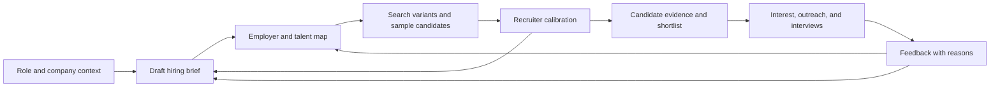

# How leading AI sourcers turn a job into a candidate search

Research completed 17 September 2026. This report covers current public product documentation, help centers, engineering articles, and dated releases. It does not assess the current RecruiterStack implementation: the product has changed since the earlier audit, and those findings have deliberately been excluded.

The named products are Metaview, Jack & Jill, Pin, and provisionally **Noon AI**—the recruiting product at noon.ai, assumed to be the intended “Noun AI.” Additional references are Juicebox, Findem, LinkedIn Hiring Assistant, SeekOut, hireEZ, and Ashby. They represent different operating models, rather than interchangeable products with a proven quality ranking.

Detailed evidence is in the [six-vendor research appendix](/Users/sagar/recruiterstack/docs/research/ai-sourcers-benchmark-2026-09-17.md) and [SeekOut/hireEZ appendix](/Users/sagar/recruiterstack/docs/research/enterprise-sourcers-2026-09-17.md). Links beside claims below lead to primary sources. “Documented” means a vendor describes the feature; it does not mean we tested its quality in a paid account.

## 1. The central finding

The clearest product pattern is an editable hiring brief connected to market exploration, candidate evaluation, and feedback. A recruiter can change their mind after seeing actual people, and the system must translate that change into a different search and assessment.

Three questions organize the work:

1. **What would success in this role require?** Scope, outcomes, constraints, working environment, and acceptable tradeoffs.
2. **Where is evidence of that capability likely to exist?** Titles, comparable problems, employers, teams, career paths, and observable work.
3. **Which people are credible possibilities now?** Candidate evidence, uncertainty, logistics, interest, and responsiveness.

The reviewed products expose different pieces of this process. The public evidence is strongest for structured briefs, editable criteria, employer filters, example-based calibration, and recurring search. It is weaker for the complete causal reasoning from business outcomes to the exact organizations and teams that develop the required capability. That distinction matters when evaluating claims that an agent “thinks like a recruiter.”

This is an analytical synthesis of the products, not a claim that every vendor runs this exact workflow:

## 2. What each product contributes to the benchmark

The “reference value” column is our judgment about which aspect is useful to study, not a ranking of sourcing performance.

| Product | Documented approach | Reference value | Qualification |
|---|---|---|---|
| **Metaview** | Its sourcing ICP explicitly contains must-haves, preferences, target companies, and anti-patterns, reviewed before search. | A directly comparable ICP workflow and continuity of hiring context. | Session calibration and reusable workspace knowledge are distinct. Check outbound and inbound features separately. [Sourcing guidance](https://support.metaview.ai/sourcing/sourcing-best-practices) |
| **Jack & Jill** | Builds a researched, editable hiring brief with reference candidates and explicit criteria. | A visible definition of recruiter intent. | Employer tool with a candidate-side network; its warm-introduction workflow differs from open-market sourcing. [Brief](https://www.jackandjill.ai/docs/hiring-brief), [Introductions](https://www.jackandjill.ai/docs/introductions) |
| **Noon AI** | Repeated sourcing and feedback; separates fixed requirements from secondary filters that may broaden. | Keeping discovery active while controlling tradeoffs. | The exact learning algorithm and refresh guarantees are not public. [AI Sourcer](https://www.noon.ai/product/ai-sourcer) |
| **Pin** | Preferred/excluded employers, reusable company lists, similar-company expansion, and live talent-pool previews. | Practical company targeting and intake feasibility checks. | Pool and salary previews are estimates. [Company preferences](https://docs.pin.com/customizing-candidate-preferences-by-company), [Talent Preview](https://www.pin.com/blog/talent-preview/) |
| **Juicebox** | Separates filters from evaluation criteria; researches the market, tests queries, and calibrates with examples. | A detailed interface for converting a brief into a usable search. | Qualified-pool estimates and inferred fit still need validation. [Agents](https://docs.juicebox.ai/juicebox-agents) |
| **Findem** | Uses career and company context, market intelligence, and expert-labeled attributes. | Understanding the environment in which experience was gained. | Its dedicated Calibration Agent is explicitly early access. [Success Signals](https://www.findem.ai/why-findem/success-signals), [Calibration Agent](https://www.findem.ai/agents/calibration-agent) |
| **LinkedIn Hiring Assistant** | Describes separate intake, sourcing, evaluation, and learning components operating over its recruiting tools. | Public engineering evidence of iterative search orchestration. | Its native network and activity signals are not reproducible through a public-profile API alone. [Engineering account](https://www.linkedin.com/blog/engineering/ai/how-we-engineered-linkedins-hiring-assistant) |
| **SeekOut** | Guided intake, previous-employer preferences, editable evaluation criteria, then candidate review. | A concrete intake-to-scorecard workflow. | Search scope and candidate evaluation remain distinct controls. [Workspaces help](https://support.seekout.com/en/articles/12805473-how-to-use-seekout-workspaces) |
| **hireEZ** | Builds an editable persona from intake, filters, or sample candidates; supports conversational refinement. | Enterprise sourcing workflow and employer expansion. | Successful-hire uploads for custom calibration are labeled future scope, distinct from existing sample-candidate input. [Operating guide](https://hireez.com/blog/mastering-ez-agent-your-guide-to-effective-prompts-in-hireez/), [One-pager](https://hireez.com/one-pager/) |
| **Ashby** | Uses job criteria to rediscover candidates already in the ATS and refreshes returned profiles when data is available. | Reusing known candidates and prior hiring evidence. | This is a rediscovery comparator, not evidence of an equivalent external-web sourcing product. [May 2026 release](https://www.ashbyhq.com/product-updates/ai-talent-rediscovery) |

## 3. Where the recruiter reasoning actually happens

### Defining the role

Jack & Jill makes the examples, evaluation criteria, search direction, and practical terms inspectable together. Our interpretation: an ICP works better as a maintained decision document than as a descriptive paragraph. [Hiring Brief](https://www.jackandjill.ai/docs/hiring-brief)

Intake is also becoming a market conversation. Juicebox describes showing candidate-pool insights and sample profiles during the hiring-manager call, then linking structured notes back to the transcript. Pin's Talent Preview, announced **15 September 2026**, estimates pool characteristics as the role is entered. Both give concrete evidence that feasibility checks can happen before a full sourcing run. Neither source establishes that every underlying candidate fact is refreshed at that instant. [Juicebox Intake](https://docs.juicebox.ai/intake), [Pin release](https://www.pin.com/blog/talent-preview/)

### Translating requirements into search and assessment

Juicebox provides an explicit product distinction: filters determine inclusion, while criteria evaluate nuanced fit. Its criteria can be reordered, reused, and inspected against profile evidence. It also distinguishes the total matching pool from the subset actually evaluated, which prevents an interface from implying that every possible candidate has been deeply reviewed. [Filters versus criteria](https://docs.juicebox.ai/filters-vs-criteria), [Criteria documentation](https://docs.juicebox.ai/criteria)

This distinction has a direct consequence for an ICP. “Based within commuting distance” may be a searchable fact. “Has personally led recovery from production incidents” requires evidence in work history or another source. “Would enjoy our operating style” needs direct validation. Putting all three into one filter list loses their different meanings.

There is also a difference between broad retrieval and strict qualification. A profile can be worth retrieving even when it does not yet establish every requirement. Conversely, a famous employer or matching title can justify a closer look without proving competence.

### Finding plausible alternative paths

Current/past employer controls and title expansion are widely described, but they are only partial evidence of genuine alternative-path reasoning. A tool that adds title synonyms has not necessarily established why an adjacent industry prepares someone for the same work.

LinkedIn's engineering account explicitly describes generating multiple queries and refining search using evaluation feedback and talent-market information. This supports an iterative search interpretation rather than a single generated query. The account also describes evidence-backed evaluation and recruiter review of proposed qualification changes. Its implementation remains first-party evidence, not an independently reproduced experiment. [Engineering article](https://www.linkedin.com/blog/engineering/ai/how-we-engineered-linkedins-hiring-assistant)

For vendor demonstrations, the revealing test is to ask for a credible candidate outside the obvious title or company list, then require an explanation of the equivalent work they have done. A satisfactory explanation connects the candidate's work to the role's requirements; “the AI thinks they are similar” is insufficient.

### Calibrating with real people

The purpose of calibration is to discover what the recruiter meant but did not specify. Useful feedback describes the discriminating fact: managerial scope, hands-on recency, product complexity, customer type, or ownership of an outcome.

Juicebox's documentation recommends reviewing until three consecutive examples are acceptable before activating an agent. That is a workflow heuristic, not statistical proof of search quality. Jack & Jill also documents reference profiles and conversational refinement. These establish that real examples can help define the brief itself. [Juicebox setup](https://docs.juicebox.ai/juicebox-agents), [Jill discovery](https://www.jackandjill.ai/docs/search-and-candidate-discovery)

Calibration quality depends on the examples shown. Ten nearly identical profiles reveal less than a small set exposing meaningful tradeoffs. This is our analysis: a strong demo should include a clear fit, a near miss, and an adjacent candidate, rather than only presenting the agent's safest matches.

### How much of the causal chain is actually established?

This table summarizes the evidence cited above and in the vendor appendices. A gap means the reviewed public evidence did not establish the capability, not that the vendor necessarily lacks it.

| Transition | Concrete public evidence | What remains unproven |
|---|---|---|
| Role context → explicit hiring bar | Jill's brief, SeekOut's scorecard, hireEZ's editable persona, Metaview's ICP. | Whether the system consistently recovers unstated business outcomes and challenges contradictory requirements. |
| Hiring bar → plausible prior experience | Reference profiles, nuanced criteria, career-context attributes. | Systematic generation of several distinct, causally justified candidate backgrounds. |
| Prior experience → employers | Named-company preferences, category expansion, feeder-company history. | Reliable team/project maps and an evidence-backed explanation of why each employer develops the required capability. |
| Employers/backgrounds → executable search | Juicebox's structured filters, SeekOut's visible search controls, LinkedIn's multiple-query architecture. | Comparable retrieval quality on the same jobs and provider coverage. |
| Retrieved person → defensible assessment | Criterion-level assessment, profile highlights, written rationale. | Factual accuracy of every inference, consistent missing-data treatment, and calibrated fit probabilities. |
| Professional match → mutual opportunity | Jack & Jill's candidate-side introductions; outreach and response workflows across other products. | Current candidate interest before direct input, or proof that interest predicts eventual acceptance. |
| Feedback → better next search | Documented preference memory, criteria edits, query refinement, reassessment. | The exact update mechanism and independently measured improvement attributable to it. |

## 4. Target companies: six different capabilities

“Uses target companies” is too broad to serve as a useful comparison. These operations are different:

| Capability | What it means | Evidence in the reviewed products |
|---|---|---|
| **Employer preference** | Favor or select people from named organizations. | Pin explicitly documents job-level preferences based on past or current employers. [Help](https://docs.pin.com/customizing-candidate-preferences-by-company) |
| **Operational exclusion** | Avoid an employer or candidate because outreach is inappropriate for this search. | Pin documents blocklists as a separate control. [Blocklists](https://docs.pin.com/adding-candidates-to-block-list) |
| **Reusable company sets** | Save a sourcing map for use across roles. | Pin supports company presets, including CSV import. [Presets](https://docs.pin.com/create-company-presets) |
| **Comparable-company expansion** | Find related employers beyond the supplied names. | Pin documents an Include Similar expansion; Juicebox accepts descriptions of company cohorts. [Pin update](https://www.pin.com/blog/june-2026-product-updates/), [Juicebox filters](https://docs.juicebox.ai/filters) |
| **Experience at a particular company stage** | Check whether a person was there when the relevant environment existed. | Juicebox supports employer groups with funding-stage and date conditions. [Filters](https://docs.juicebox.ai/filters) |
| **Empirically discovered feeder employers** | Learn where a team's recent hires came from. | Juicebox's Knowledge Vault describes automatically derived feeder companies and hiring patterns. [Memory documentation](https://docs.juicebox.ai/knowledge-vault) |

The more demanding recruiter question is: **which organizations contain teams solving the problems this person will own?** That can differ substantially from “which companies resemble the hiring company?” A payments team inside a marketplace might provide stronger relevant experience than an unrelated team inside a fintech.

Metaview also explicitly places target companies inside the approved ICP. That is stronger evidence than a general talent-mapping article: company targeting is part of its documented sourcing setup. [Sourcing guidance](https://support.metaview.ai/sourcing/sourcing-best-practices)

The reviewed documentation does not consistently establish automatic, team-level maps with reliable project attribution. Treat that as an open verification question, even for vendors that advertise company intelligence.

Employer context also has a time dimension. A candidate's experience at a company during an early product phase differs from joining its mature organization years later. Findem describes a person–company–time data model, and Juicebox exposes temporal employer conditions directly. This is a stronger approach to context than assigning a present-day company label to every alumnus. [Findem's data-model explanation](https://wf.findem.ai/blog/generative-ai-comes-to-findem-talent-data-cloud), [Juicebox filters](https://docs.juicebox.ai/filters)

## 5. What “learning,” “fit,” and “real time” actually mean

### Learning can change five different things

| Mechanism | Observable result | What to ask a vendor to demonstrate |
|---|---|---|
| Remembering preferences | A later search incorporates stored context. | Show the memory, its origin, scope, and how it is corrected. |
| Revising the brief | A requirement or priority changes. | Show the before/after criteria and approval history. |
| Revising retrieval | Different people enter the candidate pool. | Show which query or company cohort changed. |
| Re-evaluating candidates | Already-discovered people receive a fresh assessment. | Revisit a previously rejected profile after a criterion changes. |
| Training or updating a model | General model behavior changes from new examples. | Explain the training process and validation; do not substitute a chat-memory demo. |

Juicebox explicitly documents organizational and user memory and shows when remembered context contributes to a criterion. Descriptions can be corrected; its generated feeder-company and hiring-pattern lists are not directly editable. That is concrete evidence of context persistence, with a meaningful control limitation. [Knowledge Vault](https://docs.juicebox.ai/knowledge-vault)

Noon's stronger terminology around reinforcement learning does not by itself reveal which of these mechanisms updates, how quickly, or with what measured improvement. The benchmark therefore treats its documented feedback behavior separately from its model-training claims. [Noon](https://www.noon.ai/)

### Fit is more than one number

For comparison purposes, separate:

- **Professional fit:** relevant work, scope, skill, and outcomes.
- **Evidence quality:** what is observed, inferred, missing, or contradictory.
- **Opportunity fit:** compensation, location, work model, preferred responsibilities, and timing.
- **Interest:** whether the candidate actually wants to consider the role.
- **Reachability:** whether a usable, appropriate contact route exists.

These are analytical categories, not a claim that every vendor exposes all five. Jack & Jill illustrates why the distinction matters: its network introductions can use preferences collected through the candidate's relationship with Jack. Public-profile search alone cannot establish the same mutual interest. [Introductions](https://www.jackandjill.ai/docs/introductions)

Even visible uncertainty labels require scrutiny. Juicebox describes a potential-fit category for ambiguity, but its not-a-match description also includes lack of supporting evidence. Its good-match category may include AI inference. Those labels should not be treated as independently verified facts or calibrated probabilities. [Criteria](https://docs.juicebox.ai/criteria)

### Real time has several clocks

| Clock | Meaning |
|---|---|
| Search response | How quickly a changed brief produces a result. |
| Index freshness | How recently the provider observed the underlying profile. |
| Enrichment freshness | Whether an individual shortlisted profile was refreshed now. |
| Reassessment | How quickly a criteria change updates old recommendations. |
| Candidate intent | How recently the person confirmed availability or interest. |

An immediate pool preview establishes responsive querying, not fresh intent. Daily sourcing establishes a run schedule, not a daily refresh of every profile. Juicebox's source documentation states that data is refreshed but publishes no precise cadence there. Ashby explicitly describes refreshing returned rediscovery profiles when data is available. These are different promises. [Juicebox data sources](https://docs.juicebox.ai/data-sources), [Ashby rediscovery](https://www.ashbyhq.com/product-updates/ai-talent-rediscovery)

## 6. Candidate persona versus personality

For the original ICP concept, the useful output is a set of **professional archetypes with evidence requirements**. It describes plausible ways someone could have become effective at the job. It should not claim to know a person's temperament from their title, employer, or public biography.

Consider an illustrative brief: a small fintech needs a backend lead who can improve payment reliability while continuing to code. This is a synthetic example, not a current job or a real candidate search.

| Candidate path | Why it might work | Evidence to seek | What remains to validate |
|---|---|---|---|
| Payments engineer stepping into leadership | Direct domain and failure-mode familiarity. | Ownership of transaction services, incident work, mentoring. | Can they lead the required team and scope? |
| Distributed-systems lead from an adjacent sector | Comparable consistency, reliability, and scale problems. | Relevant design decisions and operating responsibility. | How quickly can they learn payments-specific constraints? |
| Technical lead from an earlier-stage product company | Broad ownership with limited specialist support. | Recent hands-on work, hiring, operational tradeoffs. | Is their reliability experience deep enough? |

The next step is to identify the employers and teams likely to contain each path, retrieve real examples, and compare them against the same outcomes. A recruiter might discover that direct payments experience is less important than owning incident recovery, or that current managerial titles hide a lack of recent hands-on work.

This example is our synthesis of the research. It does not imply that each vendor automatically constructs distinct archetypes or can verify every required behavior. The reviewed products offer pieces of this process; a vendor trial should test the complete transition.

## 7. What to verify before declaring any product “best”

The public research establishes useful workflow benchmarks. It cannot establish a sourcing-quality leaderboard, comprehensive coverage in a geography, or a reliable probability that a surfaced person will succeed.

Use a small controlled trial with the same representative jobs, equivalent input context, and a fixed review budget. Include narrow-domain roles, ambiguous titles, adjacent-skill roles, and an intentionally overconstrained role. Keep the first slate and the post-feedback slate separate.

Run two comparisons where product controls permit: **assessment on the same supplied profiles**, and **open discovery against each vendor's own data**. This separates reasoning quality from proprietary data coverage. Blind reviewers to the vendor identity while retaining job-relevant employer and project evidence. Report unique relevant discoveries and retrieval of known suitable candidates; do not claim recall across the entire labor market without a known reference population.

For each role, require these demonstrations:

1. **Interpret the job:** identify the outcomes and explain which inputs support the criteria. Distinguish requirements from assumptions.
2. **Construct a company map:** accept named employers, generate alternatives, and explain why each cohort is relevant. Include current/past employment and historical company stage where appropriate.
3. **Expose search logic:** show hard constraints, ranking preferences, alternatives, and exclusions. Reveal any relaxation.
4. **Calibrate:** review the same few contrasting profiles and supply criterion-specific feedback. Observe changes to both retrieval and assessment.
5. **Handle incomplete evidence:** remove a skill from a profile without changing its actual experience. Verify that uncertainty is distinguishable from disqualification.
6. **Show freshness:** display observation timestamps, refresh behavior, and source links for the shortlist.
7. **Separate interest:** distinguish inferred willingness to move from a candidate's stated preference or reply.
8. **Revisit history:** change a requirement and inspect an earlier candidate, the old rationale, and the new decision.

Measure reviewer-approved candidates in the first 20, evidence accuracy, credible adjacent candidates found, time to the first usable slate, cost per approved candidate, and improvement after feedback. Count qualified interviews separately from positive responses. Record reviewer disagreement rather than treating one person's preference as unquestionable ground truth.

The most useful benchmark for the later ICP evaluation is whether a system maintains a clear connection between **role outcomes, searchable evidence, employer context, actual candidates, and recruiter feedback**. This report establishes that external reference point; the changed RecruiterStack implementation should be evaluated afresh against it.
