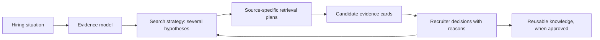

# Sourcing agent: clean-slate product and technical plan

**Date:** 23 September 2026
**Scope:** A new sourcing product definition. This deliberately does not preserve the current ICP, prompt, search-plan, or scoring design as a constraint.

## The decision

Do not build a better ICP generator. Build an **evidence-driven sourcing operating system** that helps a recruiter decide who to search for, where to find them, and why each person deserves attention.

The agent's product output is a living **Search Strategy**, not a prose candidate persona and not one generated query. A strategy contains several testable talent hypotheses, the evidence each hypothesis requires, the source queries that represent it, and the recruiter decisions that improve it.

The agent should make a recruiter faster at three linked decisions:

1. What work will make this hire successful?
2. What prior work is credible evidence that somebody can do it?
3. Which market segments should we spend sourcing credits and recruiter time on first?

## Why the prompt A/B test converged

The reported A/B result differed mostly in competency labels and weights. Both variants still placed the same obvious people near the top, including people whose work was clearly outside a Strategy & Operations remit.

That is expected. The experiment scored a shared internal candidate set using broad, model-generated criteria. It did not compare two distinct market-search strategies, candidate segments, or recruiter-approved slates. A stronger prompt alone cannot create missing company/team facts, discover different people, establish a candidate's actual ownership, or learn from a recruiter's decision.

The replacement unit of experimentation is therefore a **strategy**, not a prompt:



## Product principles

1. **Start with the job to be done.** A title is an index, not a specification. The agent starts with the outcome, mandate, constraints, and environment.
2. **Show the reasoning.** Every rule says why it exists, what evidence supports it, and what it risks excluding.
3. **Search segments, not one ideal candidate.** A good recruiter explores several credible paths to success and compares them.
4. **Retrieve broadly enough to learn; qualify precisely enough to save time.** A candidate can be worth retrieving before all evidence is known.
5. **Evidence outranks pedigree.** Employer, school, title, and tenure are routing signals. They are not proof of capability or interest.
6. **Unknown is valuable.** Missing data becomes a question or verification task, not a fabricated answer or an automatic rejection.
7. **The recruiter owns the final rule.** The agent proposes; a recruiter approves, edits, or rejects. Learning is visible and scoped.
8. **Spend is intentional.** Before a paid provider call, show the segment, projected reach, expected trade-off, and budget.

## The product object: Search Strategy

Replace the one-dimensional ICP with a typed strategy object. It is versioned, reviewable, and vendor-neutral.

```ts
type EvidenceStatus = 'confirmed' | 'sourced' | 'hypothesis' | 'unknown'

type SourcingStrategy = {
  hiringSituation: {
    company: CompanySituation
    team: TeamSituation
    role: RoleSituation
    market: MarketSituation
    facts: Fact[]
    unresolvedQuestions: Question[]
  }
  successModel: SuccessOutcome[]
  rules: SourcingRule[]
  segments: SearchSegment[]
  evaluationPlan: EvaluationPlan
  version: number
}

type SourcingRule = {
  id: string
  claim: string
  class: 'eligibility' | 'retrieval' | 'ranking' | 'screen' | 'hypothesis'
  evidenceStatus: EvidenceStatus
  rationale: string
  evidenceToSeek: string[]
  exclusionRisk: string | null
  owner: 'recruiter' | 'hiring_manager' | 'agent'
}

type SearchSegment = {
  id: string
  name: string
  thesis: string
  comparableWork: string
  targetEnvironment: string
  retrievalRules: string[]
  verificationRules: string[]
  tradeOff: string
  budgetShare: number
  status: 'proposed' | 'approved' | 'paused' | 'exhausted'
}
```

The important distinction is rule class:

| Rule class | Example | Behaviour |
|---|---|---|
| Eligibility | Must be legally eligible to practise | A confirmed, explicit constraint; filter or screen |
| Retrieval | Has operated an API at meaningful payment volume | Query where a provider can express it; otherwise retrieve via proxies |
| Ranking | Has personally established a production incident process | Scores evidence, never rejects on missing profile text |
| Screen | Wants a hands-on individual-contributor role | Asked in conversation; never inferred from title |
| Hypothesis | Small-team platform experience is likely useful | Runs as a measured search segment until recruiter evidence confirms or rejects it |

## The recruiter workflow

### 1. Frame the hiring situation

The agent consumes the JD and existing company data, then asks only questions that materially alter a strategy. The first screen should ask for:

- what this person must have achieved after six and twelve months;
- whether this is a new mandate, growth role, or replacement;
- the team today, the team being built, the manager, and key interfaces;
- non-negotiable logistics, compensation, licensing, and work authorization; and
- acceptable trade-offs: adjacent domain, seniority, location, industry, or management scope.

The user sees a short factual brief and explicitly marks assumptions. A company can be mature while a team is new; funding stage and operating stage are distinct fields.

### 2. Propose a market map

The agent produces three to five segments, not one profile. Example for a new payments-platform engineer:

| Segment | Thesis | Evidence to verify | Trade-off |
|---|---|---|---|
| Direct domain operators | Operated reconciliation or transaction-observability systems | Personal incident and correctness ownership | Often highly sought after |
| Adjacent correctness systems | Built auditable logistics, marketplace, or ledger-like systems | Equivalent reliability/problem depth | Needs domain onboarding |
| Early platform builders | Created operating practices in a small engineering group | Established on-call, runbooks, and mentoring | May not have payments exposure |

Every company suggestion must state the problem/team/environment it represents. A recruiter can remove a segment, add a company, or widen the definition before credits are spent.

### 3. Preview before acquisition

For each segment, show:

- the actual source filters and unsupported requirements;
- count or estimated reach, freshness, and expected cost;
- a small, clearly-labelled sample when available; and
- the condition that causes the next segment to open.

The recruiter allocates a budget across segments or lets the agent use an agreed exploration policy. A source provider is an adapter; the strategy never exposes provider-specific concepts as the product's core model.

### 4. Present evidence cards, not a magical fit score

Each candidate card answers:

- Which segment found this person?
- What evidence supports each important capability?
- What is missing or contradictory?
- Which rules were filters, which were rankers, and which need a screen?
- What would make the recruiter advance, reject, or hold them?

Show separate signals for **capability fit**, **evidence coverage**, **practical constraints**, and **mutual-interest unknowns**. A single score can remain as a sorting aid but must never hide these dimensions.

### 5. Calibrate deliberately

The recruiter gives a decision and selects a reason, then may add free text:

- right environment, wrong personal ownership;
- strong adjacent background;
- correct scope, wrong customer/problem type;
- too senior for confirmed scope;
- missing evidence—screen before deciding; or
- irrelevant segment.

The agent proposes a visible change: adjust a rule, pause a segment, widen a segment, add a verification question, or revise the role framing. It never silently retrains or changes the search.

## Technical architecture

### 1. Strategy engine

Use an LLM to transform an evidence packet into a typed draft strategy, explain ambiguity, and propose alternatives. Do not let it directly generate provider filters or irreversible exclusions.

Use deterministic code to:

- validate types and rule classes;
- enforce confirmed-only eligibility filters;
- compile segments to provider capabilities;
- apply budgets and stop conditions;
- calculate evidence coverage; and
- maintain versions and an audit trail.

### 2. Company and work-context graph

Model the hiring company and candidate employers as entities, with time-aware facts:

- company, product/customer, business model, operating stage, team/function, scale;
- candidate employment period, title, team when known, and work claims; and
- fact source, observed date, confidence, and recruiter correction.

Crustdata can initially supply people and company attributes where available. The product's domain model must not assume any one provider supplies team-level truth.

### 3. Retrieval compiler layer

Each source advertises what it can actually express: employer history, title, location, skill, company size, industry, education, recency, or nothing. The compiler returns:

- executable query;
- unsupported checks that move to post-fetch verification;
- estimated query breadth; and
- traceability from provider condition back to strategy rule and segment.

This makes a new provider additive and prevents the agent from pretending every rule is searchable.

### 4. Candidate evidence layer

Normalize profiles into claims rather than flattening them into a résumé string. A claim contains value, source, date, confidence, and supporting excerpt. Candidate assessment should be an evidence matrix against success-model capabilities, with `supported`, `contradicted`, and `unknown` states.

### 5. Experiment and learning layer

Persist every strategy version, segment, query compilation, candidate acquisition, reviewer decision, and decision reason. This creates the defensible learning data: not “the model liked this person,” but “for this type of role, recruiters accepted candidates from this segment when they had this evidence.”

## Delivery sequence

### Phase 0 — Instrument and define the scorecard

Build no new automation until the team can measure it.

- Define strategy, segment, candidate-evidence, and recruiter-decision events.
- Establish baseline metrics for the current flow.
- Build a review interface that captures structured rejection and advance reasons.
- Choose 10–20 real roles across at least three role families as an evaluation set.

**Exit condition:** Every sourced candidate can be traced to a query/segment and every recruiter decision has a useful reason.

### Phase 1 — Search Strategy MVP

Ship the strategy object and a concise hiring-situation interview.

- Generate a proposed factual brief, success model, and three segments.
- Let recruiters approve/edit before any market search.
- Compile one provider adapter and show executable filters plus unsupported checks.
- Display segment-level counts and spend previews.

**Exit condition:** Recruiters can explain why every active segment exists and can alter it without prompt editing.

### Phase 2 — Evidence-first candidate review

- Create candidate evidence cards tied to segment and rule IDs.
- Separate eligibility, capability, evidence coverage, and practical questions.
- Add structured calibration and visible strategy diffs.
- Remove any automatic score caps caused by deliberately relaxed search constraints.

**Exit condition:** A recruiter can distinguish “wrong person,” “insufficient evidence,” and “wrong strategy” in one click.

### Phase 3 — Adaptive market exploration

- Allocate budget across segments based on recruiter-approved exploration policy.
- Pause weak segments, broaden useful ones, and preserve an adjacent lane.
- Re-query only when freshness, strategy, or source data has changed.
- Add source adapters behind the same compiler contract.

**Exit condition:** The agent produces a measurable improvement in recruiter-approved candidates per sourcing credit versus a title-only baseline.

### Phase 4 — Company intelligence and reusable knowledge

- Add company/entity resolution and time-aware employer context.
- Promote proven recruiter decisions into reviewable role-family or company knowledge.
- Build employer/team maps only where data quality justifies them.

**Exit condition:** Reusable knowledge is traceable to outcomes, editable, scoped, and capable of being withdrawn.

## Business position

The customer is not buying an LLM that writes a scorecard. They are buying fewer wasted sourcing credits, a faster path from a vague requisition to credible conversations, and a process a hiring manager can understand.

The defensible asset is the recruiter-approved decision graph: how role outcomes map to evidence, segments, and eventual outcomes in each market. Raw profile access is purchasable; trustworthy, organisation-specific judgement is harder to copy.

Start with the narrow wedge: **turn a hiring-manager conversation into three explainable, testable search segments and a reviewable first slate.** Do not begin with autonomous sourcing, generic company intelligence, or broad workforce planning.

## Evaluation plan

Test strategies, not prompt prose.

For each live evaluation role:

1. Freeze the hiring situation and a credit budget.
2. Produce the current strategy and a challenger strategy.
3. Run equal market searches, preserve segment provenance, and mix the results.
4. Blind-review candidate cards without revealing variant or segment.
5. Record advance/reject/unknown decisions and reasons.
6. Compare recruiter-approved candidates per 100 profiles, per credit, and per recruiter minute; compare evidence coverage, diversity of credible backgrounds, and time to first qualified conversation.

Run several roles per role family before drawing conclusions. Prompt-output similarity alone is not a product metric.
